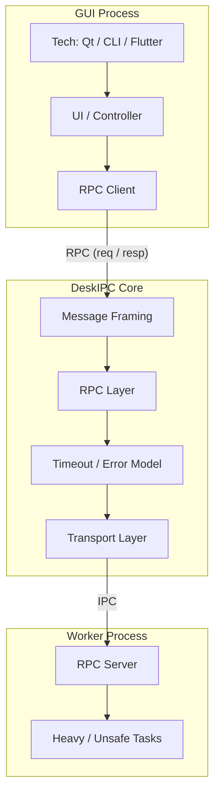

# DeskIPC

> A lightweight cross-platform IPC & RPC framework for desktop applications (C++17)

DeskIPC 是一个 **面向桌面应用的跨进程通信（IPC）与轻量级 RPC 框架**，用于构建 **多进程桌面程序中的可靠通信机制**。

该项目以 **C++17** 实现，核心库不依赖 Qt，支持在 **Windows / Linux / macOS** 上使用，适用于 Qt / Flutter / Electron / 原生 C++ 等桌面应用架构。

---

## Background & Motivation

在真实的桌面客户端项目中，常见的一种架构形态是将系统拆分为多个进程，以提升整体稳定性与可维护性，例如：

- **主进程（UI / 控制逻辑）**：负责界面展示与用户交互，要求稳定、响应迅速
- **子进程（耗时计算 / 高风险模块 / 第三方组件）**：负责渲染、计算或调用不稳定的外部依赖

典型场景包括但不限于：

- Qt 主程序 + CEF / Chromium 子进程
- UI 进程 + 大文件解析 / 索引构建进程
- 主进程 + 插件 / 扩展 / 算法 Worker 进程

在这些多进程桌面场景下，开发者往往会反复遇到一组相似的工程问题：

- 本机进程通信需要 低延迟、高可靠性，但并非分布式系统
- 直接使用 socket / pipe 容易引入 消息边界不清、粘包、半包、阻塞等问题
- 缺乏统一的 请求–响应（RPC）调用模型，通信协议往往依赖隐式约定
- 子进程异常退出或卡死时，处理逻辑复杂，容易影响主进程稳定性
- HTTP / gRPC 等通用方案在桌面 IPC 场景下 依赖过重、调试成本高、并不匹配真实需求

DeskIPC 正是在这样的背景下设计的。
DeskIPC 的目标并不是构建一个分布式 RPC 框架，而是：

- >**为桌面应用提供一套工程可控、边界清晰、易于调试的 IPC + RPC 基础设施。**

它关注的是本机多进程环境中的核心问题：
- 显式的消息边界、清晰的请求-响应模型、对子进程异常的友好处理，以及尽量少的依赖和可预测的行为。

---

## Design Philosophy

- **Desktop-first**  
  面向本机进程通信，而非分布式系统

- **Explicit boundaries**  
  显式 framing、超时和错误模型，避免隐式约定

- **Process-isolation friendly**  
  子进程失败不应拖垮主进程

- **Lightweight & controllable**  
  不过度依赖大型运行时或复杂协议

## Architecture Overview



---

## Core Features

### Transport Layer
- Windows: **Named Pipe**
- Linux / macOS: **Unix Domain Socket (UDS)**
- TCP (loopback) for development & debugging (optional)

### Protocol & Framing
- 固定长度 Header + Body（显式消息边界）
- 处理半包 / 粘包
- 请求-响应通过 `request_id` 关联
- 可扩展的版本与 flags（为压缩 / 加密 / 编码预留）

### RPC Layer
- Request / Response 调用模型
- 超时控制（timeout）与错误模型（error code + message）
- 并发 in-flight 请求（同一连接上多路复用）
- 支持通知类消息（event / one-way，可选）

### Process-oriented
- 面向多进程桌面架构：UI 进程稳定优先
- Worker 崩溃 / 卡死不拖垮主进程（可配合 process manager 自动重启）

---

## Quick Start

> 说明：v0.1 阶段优先提供 CLI 示例，先把 framing + RPC 闭环跑通；  
> Qt GUI Demo 会在后续里程碑加入。

### Build

**Requirements**
- C++17 compiler
- CMake >= 3.15

```bash
git clone https://github.com/<yourname>/deskipc.git
cd deskipc
cmake -S . -B build
cmake --build build -j
```
### Run Examples (CLI)

**启动 Worker（RPC Server）：**
```bash
./build/examples/worker_cli/worker_cli
```
**启动 Parent（RPC Client）并发起调用:**
```bash
./build/examples/parent_cli/parent_cli
```
---

## Project Structure

```text
deskipc/
├── core/
│   ├── include/deskipc/          # Public APIs（后续再整理成对外头）
│   ├── transport/
│   │   └── tcp/
│   │       └── net.h             # 原生socket跨平台工具
│   ├── protocol/
│   │   ├── frame_header.h
│   │   └── framing.h/.cpp
│   ├── rpc/
│   ├── runtime/
│   └── common/
├── examples/
│   ├── worker_cli/
│   ├── parent_cli/
│   └── parent_qt_gui/
├── tests/
├── benchmarks/
└── docs/
```

## Roadmap

- v0.1: Framing + RPC (TCP / loopback) + CLI demo (ping / add / sleep)
- v0.2: Timeout / cancellation + concurrent calls + basic unit tests
- v0.3: Windows Named Pipe transport
- v0.4: Unix Domain Socket transport (Linux / macOS)
- v0.5: Qt GUI demo (parent) + worker process manager (restart / handshake)
- v0.6: Benchmarks + CI (Windows / Linux) + docs polishing

---

## Design Notes

### Why not HTTP / gRPC? 
- DeskIPC 面向 本机 IPC 场景，更关注低延迟、显式消息边界、进程隔离与可控的错误 / 超时模型。
- HTTP / gRPC 对桌面 IPC 往往过重，并引入额外依赖与调试成本。

### Why framing first?
- Framing 是 IPC 的“消息边界协议”。一旦稳定，上层 RPC 与下层 transport 的替换成本会非常低。

### Qt is optional
- 核心库不依赖 Qt。
- Qt 仅用于提供一个更贴近真实桌面客户端的 GUI 示例。

---

## License
> MIT License
---
